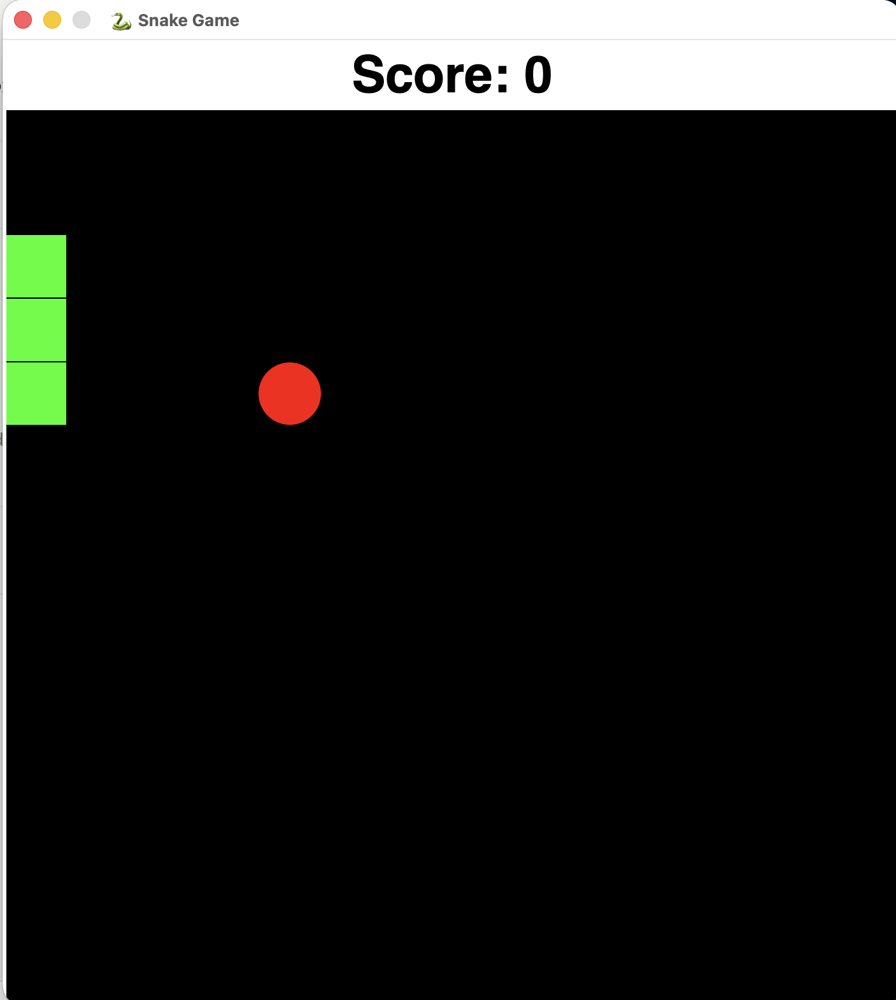

# Snake Game

A classic Snake game built in Python using Tkinter. Control the snake, eat food to grow longer, and try to rack up the highest score without running into yourself or the walls.

## Features

- 🐍 Classic Snake gameplay with keyboard controls
- 🍎 Randomly spawning food that grows the snake when eaten
- 📊 Live score tracking displayed at the top of the window
- 🎨 Simple, clean GUI built with Tkinter's Canvas
- ⚙️ Easily configurable game settings (speed, board size, colors)

## Demo



The game window shows the current score at the top, with the snake (green) and food (red) rendered on a black game board.

## Getting Started

### Prerequisites

- Python 3 installed on your system
- Tkinter (usually included with Python; on some Linux distros install via `sudo apt-get install python3-tk`)

### Installation

```bash
git clone https://github.com/anshikaaaasingh-afk/snake-game.git
cd snake-game
```

### Run

```bash
python3 snake_game.py
```

## Usage

1. Run the program to open the game window.
2. Use the **arrow keys** (Up, Down, Left, Right) to control the snake's direction.
3. Guide the snake to the red food to grow longer and increase your score.
4. Avoid colliding with the walls or the snake's own body.
5. The game ends when a collision occurs — restart the program to play again.

## Configuration

Game settings can be adjusted at the top of the script:

| Setting            | Description                              | Default   |
|---------------------|-------------------------------------------|-----------|
| `GAME_WIDTH`        | Width of the game board (pixels)          | `700`     |
| `GAME_HEIGHT`       | Height of the game board (pixels)         | `700`     |
| `SPEED`             | Delay between movements (ms) — lower = faster | `100` |
| `SPACE_SIZE`        | Size of each snake segment / grid square  | `50`      |
| `BODY_PARTS`        | Starting length of the snake              | `3`       |
| `SNAKE_COLOR`       | Color of the snake                        | `#00FF00` |
| `FOOD_COLOR`        | Color of the food                         | `#FF0000` |
| `BACKGROUND_COLOR`  | Color of the game board background        | `#000000` |

## Project Structure

```
snake-game/
├── snake_game.py   # Main source file
└── README.md       # Project documentation
```

## Possible Improvements

- Add a "Game Over" screen with a restart option
- Track and display a high score across sessions
- Add difficulty levels that increase speed as the score grows
- Add sound effects for eating food and collisions
- Add a pause feature

## License

This project is open source and available under the [MIT License](LICENSE).

## Author

Made by [Anshika](https://github.com/anshikaaaasingh-afk) as part of a growing Python/C/JavaScript portfolio.
